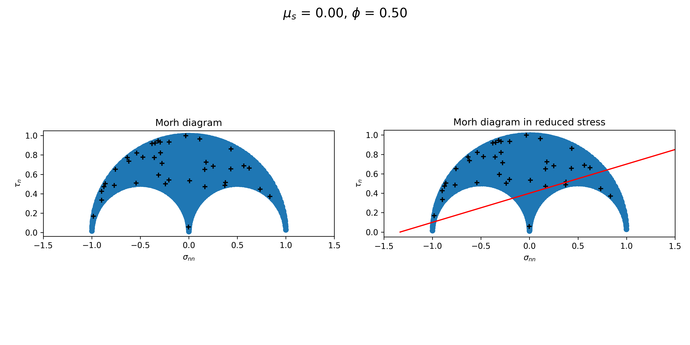

# stress_state_plot

`Stress_state_plot` is an open source structural geology package for visualisation of a given stess-state via matplotlib.

Stress state can be described by orientation of sigma axes, as well as either absolute values for each sigma axis. 
An alternative method is the describe stress state by orientation of sigma axes and by providing additional parameters such as `pressure`, `tau`, and `mu_sigma` or `phi`.

Visualisation of stress_state is performed both on stereonet and on a Morh's diagram.


## Installation

### Ubuntu

```
pip install git+https://github.com/mkondratyev85/stress_state_plot
```

## Usage

```
Usage: stress_state_plot [OPTIONS]

Options:
  --pressure FLOAT                Value of pressure.
  --tau FLOAT                     Value of tau.
  --mu_sigma FLOAT                Value of mu_sigma.
  --phi FLOAT                     Phi.
  --sigma1_value TEXT             Value of sigma1.
  --sigma2_value TEXT             Value of sigma2.
  --sigma3_value TEXT             Value of sigma3.
  --sigma1_orientation TEXT       Orientation of sigma1.
  --sigma2_orientation TEXT       Orientation of sigma2.
  --sigma3_orientation TEXT       Orientation of sigma3.
  --sigma1_orientation_and_sigma3_direction TEXT
                                  Set orientations only via single
                                  sigma1_orientationa and direction of sigma3
  --sigma3_orientation_and_sigma1_direction TEXT
                                  Set orientations only via single
                                  sigma3_orientationa and direction of sigma1
  --tau_f FLOAT                   Cohesion factor
  --k_f FLOAT                     Coefficient of friction
  --fractures TEXT                Path to the input file with fractures.
  --xlsx_path TEXT                Path to the output xlsx file with report.
  --png_path TEXT                 Path to the output xlsx file with report.
  --gui                           Plots stress in interactive GUI.
  --help                          Show this message and exit.
```


Example of usage:

```
stress_state_plot --sigma1_orientation_and_sigma3_direction="125 34 322" --pressure=-40 --mu_sigma=0 --tau=1 --tau_f=0.3 --k_f=0.3 --png_path=/tmp/fig.png
```

It is possible to plot set of fractures against given stress state:

```
stress_state_plot --sigma1_orientation_and_sigma3_direction="125 34 322" --pressure=-40 --mu_sigma=0 --tau=1 --tau_f=0.3 --k_f=0.3 --fractures=fractures.txt --png_path=/tmp/fig.png
```




Example of usage in interactive mode:

```
stress_state_plot --sigma1_orientation_and_sigma3_direction="125 34 322" --pressure=-40 --mu_sigma=0 --tau=1 --tau_f=0.3 --k_f=0.3 --fractures=fractures.txt --gui
```


