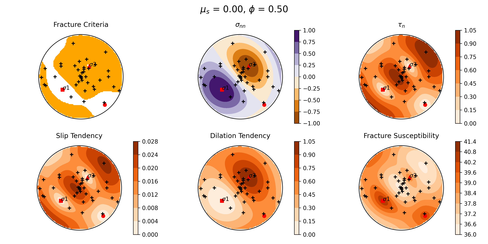
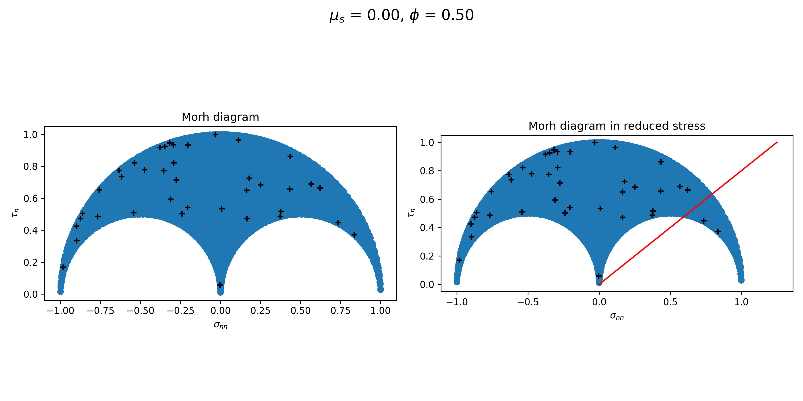
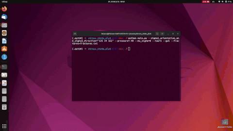

# stress_state_plot


## Installation

### Ubuntu

## Usage

```
Usage: main.py [OPTIONS]

Options:
  --pressure FLOAT                Value of pressure.
  --tau FLOAT                     Value of tau.
  --mu_sigma FLOAT                Value of mu_sigma.
  --phi FLOAT                     Phi.
  --sigma1_value TEXT             Value of sigma1.
  --sigma2_value TEXT             Value of sigma2.
  --sigma3_value TEXT             Value of sigma3.
  --sigma1_orientation TEXT       Orientation of sigma1.
  --sigma2_orientation TEXT       Orientation of sigma2.
  --sigma3_orientation TEXT       Orientation of sigma3.
  --sigma1_orientation_and_sigma3_direction TEXT
                                  Set orientations only via single
                                  sigma1_orientationa and direction of sigma3
  --sigma3_orientation_and_sigma1_direction TEXT
                                  Set orientations only via single
                                  sigma3_orientationa and direction of sigma1
  --fractures TEXT                Path to the input file with fractures.
  --xlsx_path TEXT                Path to the output xlsx file with report.
  --png_path TEXT                 Path to the output xlsx file with report.
  --gui                           Plots stress in interactive GUI.
  --help                          Show this message and exit.
```


Example of usage:

```
python main.py --sigma1_orientation_and_sigma3_direction="125 34 322" --pressure=-40 --mu_sigma=0 --tau=1 --png_path=/tmp/fig.png
```

It is possible to plot set of fractures against given stress state:

```
python main.py --sigma1_orientation_and_sigma3_direction="125 34 322" --pressure=-40 --mu_sigma=0 --tau=1 --fractures=fractures.txt --png_path=/tmp/fig.png
```





Example of usage in interactive mode:

```
python main.py --sigma1_orientation_and_sigma3_direction="125 34 322" --pressure=-40 --mu_sigma=0 --tau=1 --fractures=fractures.txt --gui
```



